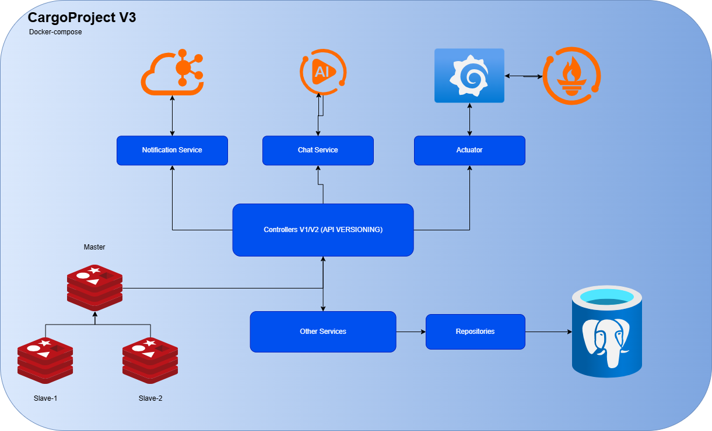
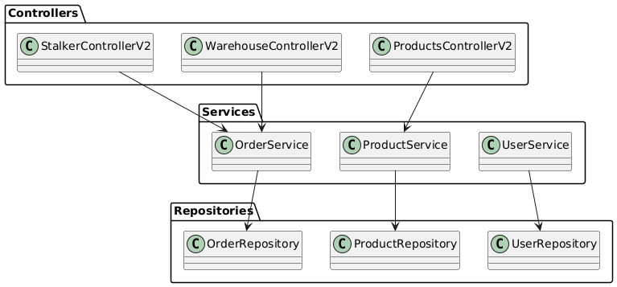
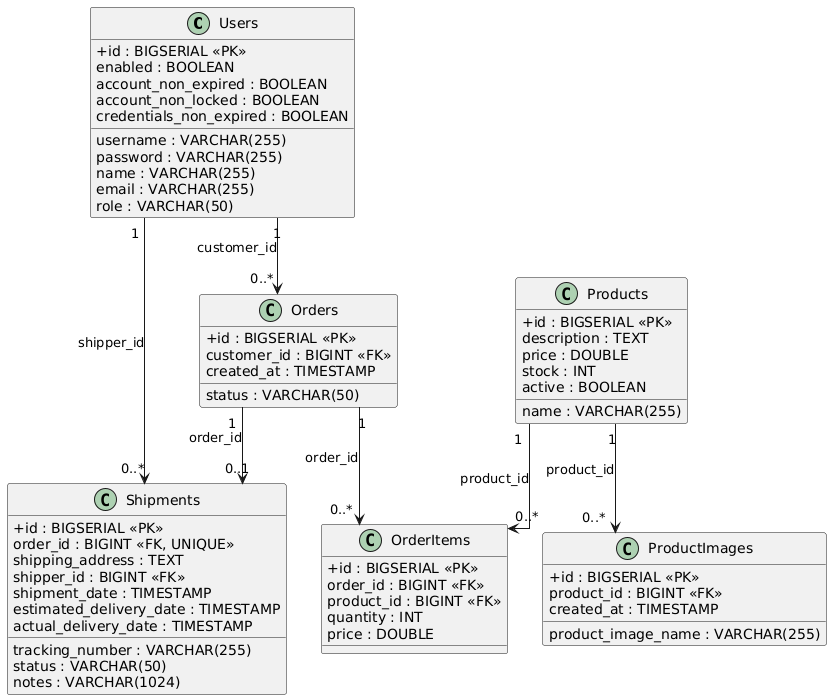
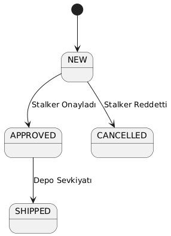
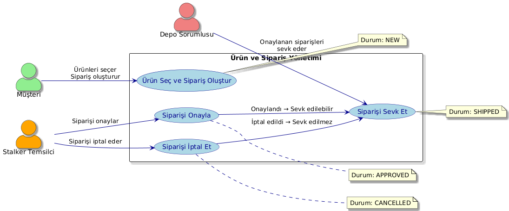
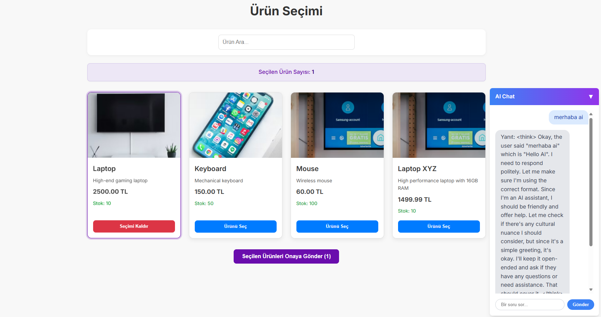
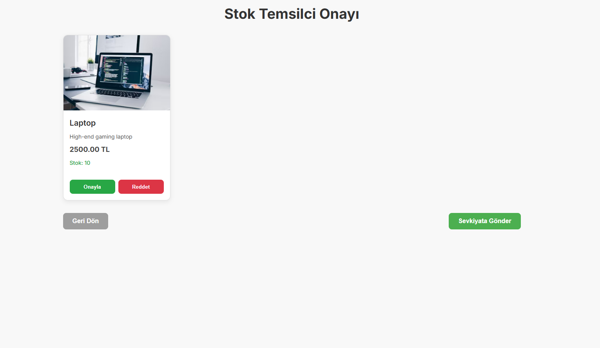
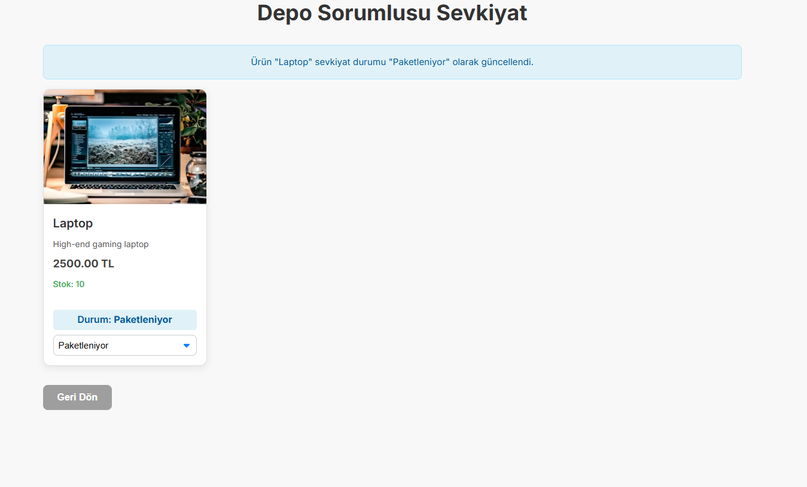

# CargoProject

CargoProject is a scalable and maintainable platform that focuses on product management, stock approval, and warehouse transport operations.  
It combines modern backend technologies, a responsive frontend, AI-driven features, and real-time monitoring to deliver an efficient system.  

---

## 🚀 Features
- **Modular-Monolith Architecture** with horizontal slicing  
- **API Versioning** for backward compatibility  
- **Authentication & Authorization** using JWT and RBAC  
- **Event-Driven Communication** with Kafka  
- **AI Integration** (Ollama AI for intelligent features)  
- **Monitoring & Observability** using Prometheus and Grafana  
- **Responsive Frontend** with ReactJS  

---

## 🏗️ High-Level Design
The High-Level Design (HLD) illustrates the overall system architecture and component interactions.  

  

---

## 🧩 Component Diagram
Shows the main modules and their relationships within the system.  

  

---

## 🗄️ Entity Relationship Diagram (ERD)
Visual representation of database entities and their relationships.  

  

---

## 📊 Monitoring Dashboard
Real-time performance monitoring with Prometheus and Grafana.  

  

---

## 🔄 State Diagram
Depicts the state transitions for key system operations.  

  

---

## 📌 Use-Case Diagram
Outlines the interactions between users and system functionalities.  

  

---

## 💻 UI Pages

### Product Selection Page
User interface for browsing and selecting products.  

  

---

### Stock Stalker Acception Page
Approval interface for stock management and processing.  

  

---

### Warehouse Transport Page
Logistics management interface for warehouse transport operations.  

  

---

## 📦 Technologies
- **Backend:** Spring Boot, PostgreSQL, Redis, Kafka  
- **Frontend:** ReactJS  
- **AI:** Ollama AI  
- **Monitoring:** Prometheus, Grafana  
- **Deployment:** Docker Compose, GitHub  

---

## 📑 Project Goal
The goal of CargoProject is to provide a robust and scalable platform that streamlines product flow from selection to warehouse transport, supported by real-time monitoring and intelligent automation.  
